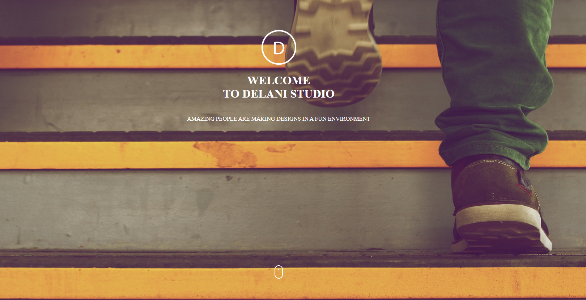

# Delani studio
IP3 - Creating the Delani studio from a given template.
### version 1.0.0

## Screeshots

## Contributors
The project was developed by Justine Kenyansa alone, but in the future, it may incorporate the work of other developers.
## :flashlight: Description
The project is a web app for Delani studio that shows the services it offers. It has detailed information about the studio.When fully developed, it shall allow users to send their messages and opinions to Delani studios.
## :pushpin: Installation Requirements
No special installation requirements. Users shall be accessign the services online.
## Known Bugs
There are no known bugs.
## :pushpin: BDD

## :computer: Technologies Used
 The project used HTML, CSS, and JS. I also used bootstrap and jQuery library.
 ## :telephone_receiver: Support and contact details
Should you have any suggestions and ideas on how to improve the app, feel free to contact me through mmogambi@gmail.com.
Code contributions are also welcome
### License
Copyright (c) {2022} **{Kentech Products}**
Licensed under the [MIT License](LICENSE).
